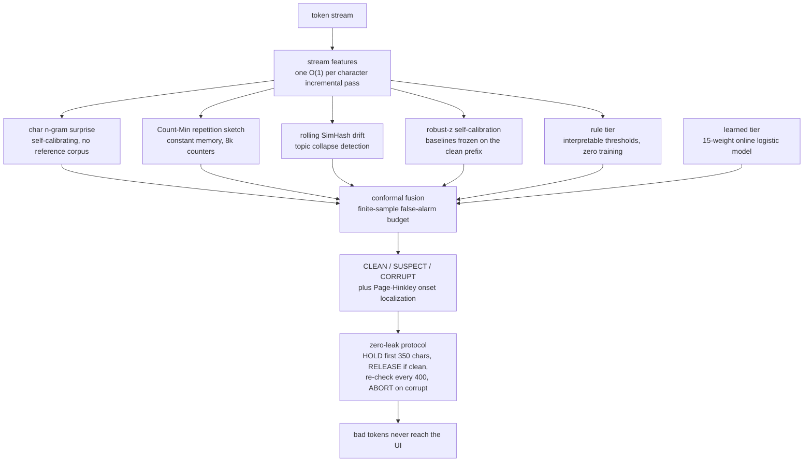

<h1 align="center">SIMURG</h1>
<p align="center"><b>Streaming Integrity Monitor &amp; Universal Regeneration Guard</b></p>
<p align="center">
Catch LLM decoding corruption <b>while the answer is still being generated</b> and cut the
stream <b>mid-flight</b>: corruption that starts in the hold window never reaches the
user, and mid-stream corruption is aborted within a few hundred characters of onset,
so the host regenerates the answer.
</p>
<p align="center">


</p>

| throughput | detection latency | false-alarm budget | footprint | setup |
|:---:|:---:|:---:|:---:|:---:|
| **197,632 chars/sec** on a laptop CPU | **~590 chars** past corruption onset | configurable, conformal-calibrated | numpy only, no model, no GPU | **3 lines**, zero training |

The guard runs hundreds of times faster than a typical LLM produces text, so it is
never the bottleneck: a model streaming at 50 tokens/sec writes ~250 chars/sec, and
SIMURG reads 197,000.

<details>
<summary><b>Table of contents</b></summary>

1. [The problem](#the-problem)
2. [Paper](#paper)
3. [How SIMURG differs](#how-simurg-differs)
4. [How it works](#how-it-works)
5. [Zero-leak in action](#zero-leak-in-action)
6. [Benchmark](#benchmark)
7. [Install](#install)
8. [Quick start](#quick-start)
9. [Teach it your domain and your failure modes](#teach-it-your-domain-and-your-failure-modes)
10. [Live guard dashboard](#live-guard-dashboard)
11. [Free web search for your agents (TinyFish)](#free-web-search-for-your-agents-tinyfish)
12. [SIMURG Pulse - the deep-learning tier](#simurg-pulse--the-deep-learning-tier-new-in-104)
13. [SIMURG Self-Heal - the guard that heals](#simurg-self-heal--the-guard-that-heals-new-in-104)
14. [SIMURG Monolith](#simurg-monolith--real-time-learning--grounded-factuality-new-in-102)
15. [What SIMURG is NOT](#what-simurg-is-not)
16. [Repository layout](#repository-layout)
17. [Roadmap](#roadmap)
18. [FAQ](#faq)
19. [Citation](#citation)
20. [License](#license)

</details>

---

## The problem

When you run an LLM in production, especially a **quantized, small, or self-hosted**
model, it sometimes **derails mid-generation**. The decoded stream stops doing the
task and collapses into one of a handful of pathologies:

| failure mode | what it looks like |
|---|---|
| **repetition collapse** | the same phrase, list, or token repeated until the token budget runs out |
| **cross-lingual drift** | an English answer that quietly slides into Chinese, Arabic, or Cyrillic |
| **regurgitation** | the model dumps a README, boilerplate, or training text |
| **structural breakdown** | `#REF! -0.00 -0.00 ... 0.00`: number and symbol garbage |
| **template leakage** | `<|im_start|>`, `</s>`, `[INST]`, "As an AI language model..." spilling into the answer |

This is **not** factual hallucination. A fluent-but-wrong sentence (see
[What SIMURG is NOT](#what-simurg-is-not)) has no statistical scar. What is shown
above is **decoding corruption**, and it leaves a *statistical signature in the
token stream*: repetition rate, lexical variety, script distribution,
compressibility, and predictive surprise all move in measurable ways.

SIMURG watches that signature character by character, decides in real time whether
the stream has gone bad, tells you **where** it started, and lets you **abort and
retry** before the user ever sees the corruption.

---

## Paper

The full technical report, with the complete evaluation, per-class analysis,
onset-localization study, and the zero-leak protocol specification:

> **SIMURG: Zero-Leak Online Detection of LLM Decoding Corruption in
> Production Streams**, F. Aghayev, E. Ahmadbayli, HAL-X AI, 2026.
> [Read the paper (PDF, 13 pages)](https://github.com/doofzoff/SIMURG/blob/main/paper/simurg_paper.pdf?raw=true)
> [Paper on SSRN](https://ssrn.com/abstract=7451269)

SIMURG is a **streaming hallucination and output-degradation detector for
LLMs**: it watches a response as tokens stream in and alarms the moment the
output degenerates (repetition loops, cross-lingual drift, regurgitation,
structural collapse).

**You can train SIMURG on your own type of hallucinations.** If your
workload has a characteristic failure mode — fabricated citations, number
drift, prompt echo, domain-specific garbage — collect or synthesize examples
of it and retrain the deep tier against your endpoint in one command (see
the Pulse section and `python3 -m simurg.deep.train_pulse --help`).

---

## How SIMURG differs

| | **SIMURG** | post-hoc linter | LLM-as-judge | perplexity threshold |
|---|---|---|---|---|
| when it fires | **mid-generation**, ~590 chars past onset | after the full answer | after the full answer | post-hoc, or needs logprob access |
| what the user sees | **zero bad tokens when onset is in the hold window**; otherwise the clean prefix plus a bad tail of at most ~900 chars, replaced by the retry | the whole corrupt answer | the whole corrupt answer | varies |
| why it fired | a named, human-readable reason on every alarm | a pattern list | the judge's opinion, if any | one number |
| model-agnostic | any OpenAI-compatible endpoint, or any stream you feed | any | any | needs a logprob-capable backend |
| overhead | numpy-only, ~197k chars/sec on one CPU core | trivial | one extra LLM call per answer | per-token logprobs |

The zero-leak property is the point: post-hoc checks can only tell you that the
answer was bad *after the user read it*. SIMURG holds the opening of every stream
in a buffer, releases it only once it is verified clean, keeps re-checking, and
cuts the stream the moment it crosses the calibrated threshold.

---

## How it works

SIMURG makes **one O(1)-per-character pass** over the stream, maintaining a set of
incremental features (digit fraction, foreign-script fraction, repetition rate,
compressibility, type-token ratio, script-switch rate, structural-artifact density,
...), and feeds a pluggable detector ensemble on top of them:



### The five detectors

| detector | what it measures | why it catches corruption |
|---|---|---|
| **char n-gram surprise** | predictive surprise of each char against an in-stream 3-gram model | loops and garbage drive surprise toward zero |
| **Count-Min repetition** | n-gram repetition rate in a constant-memory sketch | repetition collapse is the most common production failure |
| **rolling SimHash drift** | distance of a 48-token fingerprint from the clean-prefix baseline | topic collapse and regurgitation move the fingerprint |
| **robust-z self-calibration** | every feature z-scored against its own frozen clean-prefix baseline | no hand-tuned magic numbers, adapts to any domain |
| **rules** | interpretable thresholds (digit fraction, script switch, template markers, ...) | day-one coverage, every alarm is a sentence a human can read |

### Two tiers cooperate

- **Rule tier.** Interpretable thresholds on the stream features. Works on day one
  with **zero training**, and every alarm is explainable: `"repetition loop
  rate=0.71"`, `"digit fraction 0.57"`, `"script switch en to zh"`.
- **Learned tier.** A small **online logistic regression** (15 weights, a few KB)
  that adds robustness and **keeps learning in production** via `partial_fit`.

### Conformal calibration: a budget, not a hope

The fusion layer sets its thresholds from the score distribution on *clean*
streams, which gives a **finite-sample guarantee on the false-alarm rate**. "Flag
at most 2% of clean outputs" is a knob you set and the calibration enforces, not a
threshold you hope holds.

### The zero-leak protocol

1. **HOLD** the first 350 characters. A stream that is corrupt from the start is
   killed before a single character reaches the UI.
2. **RELEASE** the prefix if it scores clean, and freeze the self-calibrated
   baselines on it.
3. **Re-check** every 400 characters for the rest of the stream.
4. **ABORT** on a calibrated threshold crossing (with a 2-hit or hard-rule
   hysteresis so a single noisy checkpoint does not kill a good answer).

---

## Zero-leak in action

A synthetic stream that is clean prose and then collapses into a repetition loop
at character 339. SIMURG holds the opening, verifies the clean prefix, scores
the stream at every 400-char checkpoint, and aborts 821 characters after the
loop starts. Corrupt streams that are already bad at the 350-char checkpoint
are blocked fully (12 of 21 in the benchmark, see below); for this mid-stream
onset the user sees the clean prefix plus a short bad tail, and the guard's
contract with the host is a **retry**: `GuardedLLM` regenerates the answer and
the host replaces the shown text, so the bad tail never becomes the final
output:


Every alarm carries the reasons that fired it. For the stream above:

```
repetition loop rate=0.66 zlib=0.10
vocabulary collapse ttr=0.09
surprise collapse low_frac=1.00
```

---

## Benchmark

Reproducible end-to-end benchmark: builds the **CorruptBench** synthetic set
(243 streams, 4 failure classes), trains the learned tier, calibrates the
conformal thresholds, and reports the full table:

```bash
pip install -e .
python3 -m simurg.data.evaluate          # seed 7, deterministic dataset
```

Test split (81 streams), seed 7:

| metric | value |
|---|---|
| stream-level TPR | **78/80 = 0.975** |
| recall, repetition collapse | 16/18 = 0.89 |
| recall, cross-lingual drift | 25/25 = 1.00 |
| recall, regurgitation | 19/19 = 1.00 |
| recall, structural breakdown | 18/18 = 1.00 |
| detection latency past onset | **median 590**, p90 868 chars |
| onset localization error | median 532 chars |
| zero-leak (onset inside hold window) | 12/21 blocked fully |
| throughput | **197,632 chars/sec** |
| stream-level AUROC (final score) | 0.55, dragged down by ties at p=1.0 and a 1-stream clean test split; TPR/FPR at the calibrated threshold is the operating metric |

In addition, the shipped detector **flagged 0 false alarms on 121 real production
texts** from a self-hosted reasoning-model deployment.


**Those numbers describe the bundled domain.** The detector is only as good as the
clean corpus it calibrates against, so retrain on your own traffic before you
trust it in production. It takes seconds, see
[below](#teach-it-your-domain-and-your-failure-modes).

---

## Install

```bash
pip install simurg        # numpy only
pip install simurg[figures]   # + matplotlib, for the paper plots
pip install simurg[test]      # + pytest
```

From source:

```bash
git clone https://github.com/doofzoff/SIMURG.git
cd SIMURG
pip install -e .
```

---

## Quick start

### 1. Guard any OpenAI-compatible endpoint (3 lines)

Works with **vLLM, llama.cpp server, TGI, Ollama, SGLang, OpenAI, OpenRouter**: anything
that speaks `/v1/chat/completions`. Batteries included: the zero-leak protocol
plus an **abort, retry, fallback-model** ladder.

```python
from simurg import GuardedLLM

llm = GuardedLLM(
    "http://localhost:8000/v1", model="my-model",
    retries=1,
    fallback=GuardedLLM("https://openrouter.ai/api/v1",
                        model="qwen/qwen3", api_key="sk-..."),   # optional
)

result = llm.chat(
    [{"role": "user", "content": "Explain how oil prices affect a small economy."}],
    on_token=lambda t: print(t, end="", flush=True),             # only CLEAN text is ever forwarded
)

print(result.ok)        # True if a clean answer was produced
print(result.verdict)   # "clean" | "suspect" | "corrupt"
print(result.attempts)  # the full ladder: what each attempt did and why
```

If an attempt corrupts, **nothing from it reaches `on_token`**. A corrupt attempt
is retried; if all retries fail, the fallback model is tried.

### 2. Guard a stream from any source (5 lines)

Not on an OpenAI-style API? Wrap your own token loop:

```python
from simurg import Simurg

s = Simurg()                          # rule tier works with zero setup
for token in my_llm_stream():
    v = s.feed(token)
    if v.state == "corrupt":
        abort_and_retry(reason=v.reasons, onset=v.onset_char)
        break
    ui.write(v.released)              # text cleared for display (may lag while holding)
final = s.finish()
ui.write(final.released)
```

### 3. Post-hoc check of a finished text

```python
from simurg import Simurg

s = Simurg()
s.feed(whole_text)
print(s.finish().state)               # "clean" / "suspect" / "corrupt"
```

---

## Teach it your domain and your failure modes

### Retrain on your traffic

Feed the calibration step **your** good outputs so the thresholds fit your domain:

```bash
# bring your own clean corpus (.jsonl with a "text" field per line)
SIMURG_CORPUS_JSONL=/path/to/my_clean_outputs.jsonl python3 -m simurg.data.evaluate --save
```

Full guide, including the quick path, the live dashboard, and the production
flywheel: **[docs/TRAINING.md](docs/TRAINING.md)**.

### Teach it a NEW failure mode from examples, with an honesty gate

Give SIMURG examples of *your* model's bad outputs. It tells you **whether that
failure is even catchable** in stream statistics, and hands you a fitted detector
if it is:

```python
from simurg import fit_custom_detector

report, detector = fit_custom_detector(
    "template_leak",
    clean_texts   = my_good_outputs,     # 50+
    corrupt_texts = my_bad_outputs,      # 20+
)
print(report)
#  verdict: DETECTABLE   held-out AUROC: 0.98   -> auto-registered into every Simurg()
```

The gate is the point: fluent factual lies come back **`NOT DETECTABLE`** instead
of a false promise. Details, plus the zero-training `LexiconDetector` for known
bad markers like `<|im_start|>`: **[docs/CUSTOM.md](docs/CUSTOM.md)**.

### Watch it train, live

```bash
python3 -m simurg.training.train_live      # writes metrics for the bundled dashboard
```

A real-time web dashboard: log-loss, accuracy, AUROC, **all 15 weights animating
per epoch**, memory, and the final held-out TPR/FPR verdict.

---

## Live guard dashboard

A second web page for *runtime*: connect it to any OpenAI-compatible endpoint,
send a prompt, and watch the answer get guarded while it is generated. The
dashboard renders in real time:

- the **released stream text** (what the user would actually see),
- the **fused corruption score** with the calibrated SUSPECT/ABORT thresholds
  and the 350-char hold zone,
- the **corruption onset marker** and the human-readable **reasons**,
- **all 15 stream features** as sparklines, sampled at every checkpoint.

Every run is recorded as a **session** (timestamped frames with score, state,
released text, features and reasons). The sessions panel lists them, deletes
them, and **replays any session at up to 128x** for postmortem analysis, so a
corrupt answer from Tuesday can be re-watched the way a crash log is read.

```bash
python3 -m simurg.guard_dashboard --port 8321
# open http://127.0.0.1:8321, point it at your endpoint, guard a stream
```

Pasted texts can also be analyzed at full speed in the same UI. Same
self-contained dark style as the training dashboard, zero new dependencies:
the server is stdlib-only and acts as a CORS-free proxy to your endpoint.

---

## Free web search for your agents (TinyFish)

SIMURG can be your agent's **free** internet. The [TinyFish](https://www.tinyfish.ai)
Search API gives every SIMURG install a web-search layer — structured
`{title, snippet, url, site_name}` results at **30 requests/min, $0, no card,
no wallet draw** — so a local or small model can **re-check a fact on the web
before it commits to an answer**: fetch the evidence, feed it into the model's
context, or let the grounding verdict decide abstention. It works **out of the
box**: the package ships a free-tier TinyFish key (Search is $0 at any wallet
balance — the key carries no billing relationship), so no setup is needed.
For dedicated 30 req/min limits set your own free key
(`export TINYFISH_API_KEY=...`, agent.tinyfish.ai/api-keys), or
`export TINYFISH_API_KEY=""` to disable web search entirely:

```python
from simurg import websearch

if websearch.available():                       # True out of the box
    hits  = websearch.search("when was the Y2K bug")
    check = websearch.ground("Y2K bug")
    # check["verdict"]: "attested" | "thin" | "no_record"
    # attested   → subject is echoed in the evidence → feed check["evidence"]
    #              into the model's context
    # thin       → weak or generic hits that never mention the subject → caution
    # no_record  → nothing anywhere → likely fabricated → abstain
```

Or from any shell / agent pipeline — right after `pip install simurg`:

```bash
python3 -m simurg.websearch "when was the Y2K bug" --json
python3 -m simurg.websearch "Y2K bug" --ground    # verdict + evidence
```

The same engine powers Monolith's L4 grounded verification (below): with a key,
the web evidence is TinyFish's structured results; without one, a keyless
DuckDuckGo scrape. `ground()` also cross-checks the keyless Wikipedia hit-count
and requires the subject itself to be echoed in the evidence (generic "treaty
of 1874" hits do not attest a "Zorbachian treaty"). Stdlib HTTP only — zero new
dependencies.

---

## SIMURG Self-Heal — the guard that heals (new in 1.0.4)

The zero-leak guard cuts a corrupt stream **mid-flight** — but until now the
next step was a *blind full retry*: regenerate the entire answer, pay the full
latency again, and often corrupt AGAIN. Repetition collapse in particular is
**near-deterministic** — same context, same degenerate attractor, same loop.

**SIMURG Self-Heal** turns the abort into a diagnosis and treats it. On a
corrupt attempt the guard now:

1. **diagnoses** the fired corruption class from the sentinel's reasons
   (repetition loop / script drift / structural garbage / regurgitation);
2. **trims** the released prefix down to its verified-clean boundary — a
   periodic-loop detector finds the exact loop onset and cuts the whole loop,
   so the continuation never sees the degenerate text;
3. **steers** a targeted continuation request: the clean prefix is sent back
   as an assistant turn plus a pathology-specific instruction
   ("continue from here, never repeat" / "stay in the original language"),
   at slightly warmer sampling to break the deterministic attractor;
4. **guards** the continuation with a fresh sentinel, **stitches** prefix +
   verified tail into one answer, and runs a **post-hoc full-text verification**
   over the stitched result — the zero-leak guarantee holds for healed
   answers too; if any degenerate residue survives, it is trimmed or the
   ladder falls through to plain retries and the fallback model.

The net effect: a corrupt stream becomes a clean stitched answer in **one
generation's wall-clock** instead of two, and a degenerate attractor that a
blind retry would re-enter is escaped structurally.

```python
from simurg import GuardedLLM

llm = GuardedLLM("http://localhost:8000/v1", model="my-model")   # heal=True by default
result = llm.chat([{"role": "user", "content": "..."}],
                  on_token=lambda t: print(t, end="", flush=True))

result.healed     # True when the answer was stitched from a targeted repair
result.attempts   # e.g. [primary=corrupt, heal-1=clean] instead of [primary, retry-1, ...]

# opt out of healing for legacy abort-only behaviour:
legacy = GuardedLLM("http://localhost:8000/v1", model="my-model", heal=False)
```

The heal ladder is fully inspectable: every rung is an `Attempt` with its
state, reasons and onset, so a session replay shows exactly what was cut,
what instruction steered the repair, and what the stitched answer looks like.

---

## SIMURG Pulse — the deep-learning tier (new in 1.0.4)

The five-detector ensemble reads **15 statistics** per checkpoint. Statistics
are robust and explainable, but they compress away *sequential* structure:
the exact phase of a repetition loop, the cadence of script switches, the
texture of structural garbage. **SIMURG Pulse** adds a sixth, learned view:
a small streaming transformer (2 layers, 64-dim, 345K parameters, 1.3 MB
safetensors file) that reads the recent 600 characters and outputs a
calibrated corruption probability.

**Training on YOUR model.** The bundled weights were trained on 40 real
answers from the guarded endpoint (wahoo-1.5-preview) plus 240 CorruptBench
corruptions, with onset-aware window labels (a checkpoint only counts as
corrupt after the stream has actually corrupted — same protocol as the numpy
trainer). Retrain against any endpoint in one command:

    pip install "simurg[deep]"
    SIMURG_LIVE_URL=http://your-endpoint/v1/chat/completions \
    SIMURG_LIVE_MODEL=your-model \
    python3 -m simurg.deep.train_pulse --clean 40 --corrupt 240 --epochs 8

Training runs on CPU in seconds (the model is tiny); held-out AUROC and the
calibration anchors are printed and stored in the weights file.

**Zero-config, zero-risk.** Pulse is optional by contract: the package
imports without torch, and when torch / safetensors / a weights file are
missing the detector silently contributes 0 and every existing behaviour is
unchanged. When all three are present it joins the ensemble automatically and
participates in the same conformal fusion — a strong hit appears in alarm
reasons as "pulse deep-tier p=0.98". Inference is ~4 ms per checkpoint on
Apple Silicon (MPS), ~150x faster than a 50 tok/s model can write.

| input | pulse prob |
|:---|:---:|
| clean prose | 0.000 |
| repetition loop | 1.000 |
| cross-lingual drift | 1.000 |
| structural table echo | 1.000 |

**Weights on Hugging Face.** The trained deep-tier artifact ships in the repo
(`src/simurg/weights/simurg_pulse.safetensors`, ~1.3 MB) and is also published
as a standalone model card on Hugging Face: `MergenAI/SIMURG`. Pull the
weights from the hub directly when you want to retrain or fine-tune outside
the package:

    from huggingface_hub import hf_hub_download
    w = hf_hub_download("MergenAI/SIMURG", "simurg_pulse.safetensors")

The card documents architecture, training data, held-out AUROC (0.925) and
calibration anchors. The full model card lives next to the weights in the
repo at `src/simurg/weights/MODEL_CARD.md`.

---

## SIMURG Monolith — real-time learning + grounded factuality (new in 1.0.2)

The base guard watches the *decode*. **SIMURG Monolith** adds the layer that
watches the *facts* — and, in the spirit of the [Monolith](https://arxiv.org/abs/2209.07663)
recommender, **keeps learning while it serves**: every 👍 / 👎 a user gives an
answer is one online SGD step, so the hallucination model adapts in real time,
with no batch-retrain gap (serving loop == training loop).


It stacks five layers on top of the base guard:

- **L2 · white-box fact-uncertainty** — reads the decoder's own top-k logprobs on
  fact-bearing tokens (numbers, entities, dates). A fact the model is *torn* about
  (high entropy, competing alternatives) is flagged. This is a signal a black-box
  guard structurally cannot have — you get it because you host the model.
- **L3 · self-consistency** — resamples a claim and measures semantic entropy.
- **L4 · grounded verification** — checks the claim against **real evidence**
  (Wikipedia + the free web — TinyFish Search when `TINYFISH_API_KEY` is set,
  keyless DuckDuckGo otherwise), not against the model itself. It catches BOTH a
  *fabricated subject* (no record anywhere → abstain) AND a *wrong detail on a
  real subject* (e.g. the answer's date contradicts the sources → abstain, and it
  surfaces the correct date). A model cannot detect its own confident lie;
  external grounding can.
- **L5 · conformal abstention** — where the answer cannot be trusted, Monolith
  **abstains instead of asserting**.
- **Online model** — a small logistic model over the logprob features that
  predicts per-answer hallucination risk and trains live from your feedback
  (bootstrapped multilingual EN/RU/AZ, then adapted by real 👍/👎).

### Launch the terminal

```bash
python3 -m simurg.veritas_dashboard --port 8330 \
    --url http://your-endpoint:PORT/v1/chat/completions \
    --model your-model
# open http://127.0.0.1:8330
```

The endpoint must return `logprobs` (vLLM, SGLang, TGI, llama.cpp all can). The
terminal shows, live: the token stream coloured by uncertainty, per-token entropy
and margin, the learned-tier weight × value contribution, a feature×token
contribution heatmap, the grounded verdict (confident / hedge / abstain), and a
**real-time learning panel** where the model's weights, rolling accuracy and loss
move on every piece of feedback.

### Wire feedback from YOUR platform (serving = training)

If you integrate SIMURG into your own AI product, connect your existing like /
dislike buttons and the guard learns from real usage:

```python
from simurg.veritas.monolith import MonolithModel, aggregate

mono = MonolithModel.load("monolith_model.json")   # or MonolithModel() to start fresh

# ── at serving time: featurize the answer's fact tokens, predict risk ──
vec  = aggregate(fact_rows, corruption=corr, answer_len=len(answer))
risk = mono.predict(vec)            # 0..1 — surface it as a warning badge

# ── when the user reacts, that is your label — one online SGD step ──
mono.learn(vec, label=0)            # 👍 correct   → truthful
mono.learn(vec, label=1)            # 👎 wrong     → hallucination
mono.save("monolith_model.json")    # persist; it keeps adapting to YOUR traffic
```

`fact_rows` are the per-fact-token features the guard already computes while
streaming (entropy, margin, top-1 prob, competing alternatives). The dashboard
does exactly this over HTTP — see `veritas_dashboard.py` (`/api/feedback`).

### Free web grounding (TinyFish)

L4's web evidence runs on the same free engine described in
[Free web search for your agents](#free-web-search-for-your-agents-tinyfish):
with a key resolved (bundled free key by default, or your own
`TINYFISH_API_KEY`), the grounded verdict reports its source as
`tinyfish+wiki` instead of `web+wiki`; with web search opted out
(`TINYFISH_API_KEY=""`), the keyless DuckDuckGo scrape runs exactly as before.

### Bootstrap dataset + model

```bash
# generate the multilingual answer-level dataset from any logprobs endpoint
SIMURG_GEN_URL=http://your-endpoint/v1/chat/completions SIMURG_GEN_MODEL=your-model \
    python3 -m simurg.veritas.monolith_data.generate
python3 -m simurg.veritas.monolith_data.train     # held-out AUROC + saves the model
```

The shipped bootstrap model was trained on 300 EN/RU/AZ answers (held-out AUROC
1.0); replace it by training on your own traffic, then let live feedback refine
it. The token-level **FactPulse** dataset (`simurg/veritas/factpulse/`) documents
the honest limit that motivates L3–L5: ~78% of fabricated numbers are produced
*confidently*, so single-generation logprobs alone cannot catch them — grounding
can.

---

## What SIMURG is NOT

SIMURG detects **corrupt or degenerate decoding**, not **factual wrongness**. A
fluent, well-formed sentence that is simply *false* ("the capital of Australia is
Sydney") has no stream-statistical signature: it looks exactly like a true
sentence. For that you need **grounding** (constrain the model to retrieved facts
and make it quote them), retrieval verification, or a factuality checker.

SIMURG guards the *delivery*; grounding guards the *content*. Use both.
`fit_custom_detector` will explicitly refuse to pretend it can catch this class.

---

## Repository layout

```
src/simurg/
├── core.py              taxonomy, detector protocol, registry
├── features.py          the single O(1)/char stream-feature pass
├── websearch.py         free web-search layer for agents (TinyFish) + ground()
│                        verdict; CLI: python3 -m simurg.websearch "query"
├── signals/             the raw estimators: n-gram surprise, Count-Min sketch,
│                        rolling SimHash, robust-z calibration, Page-Hinkley
├── detection/           rules, detectors, conformal fusion, sentinel (protocol)
├── learning/            online logistic model, custom-failure-mode training (BYOC)
├── deep/                SIMURG Pulse: optional deep tier (transformer over the
│   │                     recent char window) + train_pulse trainer + detector
│   └── pulse.safetensors weights live in weights/ (optional, see [deep] extra)
├── integrations/        GuardedLLM, the OpenAI-compatible drop-in guard
├── data/                CorruptBench synth, dataset builder, benchmark, generator
├── training/            live-training run + real-time web dashboard
├── guard_dashboard.py   live guard dashboard server (stdlib-only, SSE, sessions)
├── guard_ui/            live guard dashboard front-end + recorded sessions
├── veritas/             SIMURG Monolith: fact-entropy, grounding, abstention,
│   ├── monolith.py      the online hallucination-risk model (serving = training)
│   ├── monolith_data/   multilingual bootstrap dataset + trainer + shipped model
│   └── factpulse/       token-level fabrication dataset (the confident-lie limit)
├── veritas_dashboard.py Monolith terminal server (stdlib-only, SSE, feedback API)
├── veritas_ui/          Monolith terminal front-end (real-time learning panel)
└── weights/             shipped model + conformal thresholds (use as a pair)
                         + simurg_pulse.safetensors (optional deep tier)
docs/                    TRAINING.md, CUSTOM.md
examples/                runnable quickstart
tests/                   sentinel + websearch regressions + dashboard e2e tests
figures/                 benchmark figures referenced by this README
paper/                   the full technical report (PDF)
.github/workflows/       CI: test matrix on 3.10 / 3.12 / 3.13 + build check
CHANGELOG.md             release history
```

---

## Roadmap

Ideas under active consideration, in rough priority order:

1. **Engine-level abort.** Ship integrations that stop generation *inside* the
   inference engine (a vLLM streaming hook and a generic SSE middleware proxy),
   so an abort frees GPU time instead of just saving the UI. The guard already
   exposes everything a host needs; what is missing is the wiring.
2. **Fleet telemetry.** Export `p(corrupt)`, verdict transitions, and onset
   positions as Prometheus metrics or OpenTelemetry spans, so a Grafana panel can
   show a *corruption rate per model and endpoint* and alert when a quantization
   or a prompt change starts producing bad streams.
3. **Zero-dependency runtime.** Export the guard core (features, sketches,
   fusion) to ONNX or a small C library that runs inside the inference server
   with no Python, for hosts that cannot take a numpy dependency on the hot path.
4. **CI regression suite.** A golden corpus of labeled clean and corrupt streams
   with fixed expected verdicts, plus latency and throughput budgets, run as a
   GitHub Action on every pull request: the build fails when a threshold tweak
   quietly degrades detection.
5. **Multi-stream fleet mode.** Guard N parallel live streams in one process,
   with per-stream sessions and a single dashboard that compares corruption
   rates across endpoints, so a bad quantization shows up as one lane going red
   while the others stay green.

---

## FAQ

**Will it catch factual hallucinations?**
No, and it will tell you so. Factual errors have no stream-statistical signature.
Use grounding or a factuality checker for content, SIMURG for delivery.

**What is the overhead?**
One O(1) pass per character, ~197k chars/sec on a laptop CPU. A 50 tok/s model
writes ~250 chars/sec, so the guard is hundreds of times faster than the model it
guards. Memory is bounded per stream: 8,192 sketch counters, a 48-token SimHash
window, and an n-gram table capped at 60k contexts.

**Does it only work with English?**
No. Script features are language-agnostic (per-script fractions, switch rates),
and you can declare your expected scripts at construction time
(`Simurg(expected_scripts=("cyrillic",))`). Retrain on your traffic for best
results.

**What is the SUSPECT state for?**
It is a non-blocking warning tier between CLEAN and CORRUPT. Your host can use it
to slow the UI down, show a subtle indicator, or pre-stage a retry, without
discarding a stream that may still turn out clean.

**How do I retrain on my own domain?**
`SIMURG_CORPUS_JSONL=... python3 -m simurg.data.evaluate --save` over your clean
outputs. It rebuilds the weights and the conformal thresholds in seconds. Full
guide: [docs/TRAINING.md](docs/TRAINING.md).

---

## Citation

```bibtex
@techreport{aghayev2026simurg,
  title       = {SIMURG: Zero-Leak Online Detection of LLM Decoding Corruption in Production Streams},
  author      = {Aghayev, Farid and Ahmadbayli, Elturan},
  institution = {HAL-X AI},
  year        = {2026},
  url         = {https://github.com/doofzoff/SIMURG},
  note        = {technical report, see paper/simurg_paper.pdf}
}
```

## License

**Apache-2.0**. See [LICENSE](LICENSE). Developed by **doofZ (Farid Aghayev)**,
HAL-X AI.
